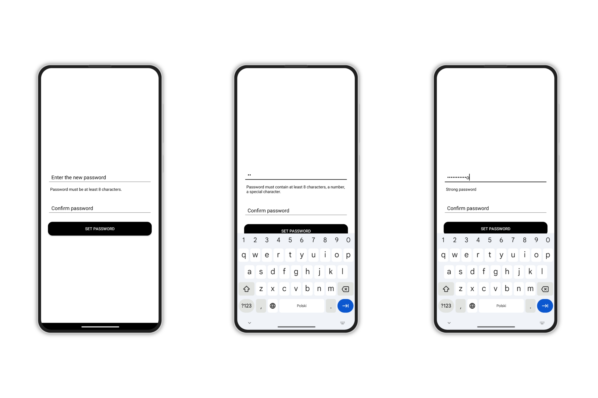
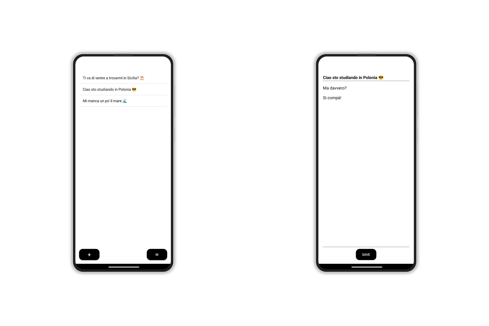
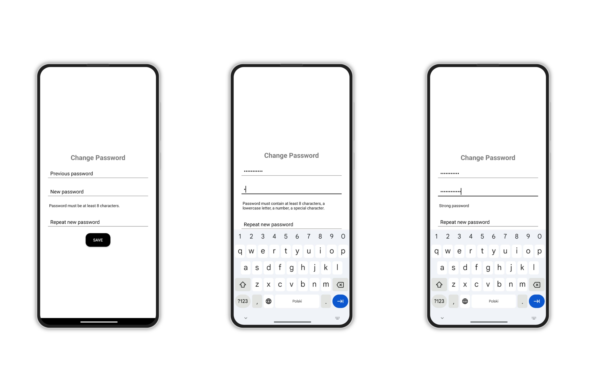
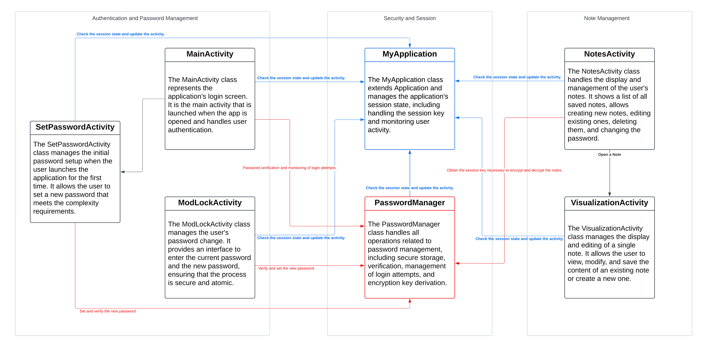

# NoteApp Implementation and Functionalities

## Overview

The **NoteApp** is a secure notepad application designed to protect user notes with robust security features. The app requires authentication to access notes and provides functionality for creating, viewing, editing, and deleting notes.

## Functionalities

### First-Time Setup

- **Password Initialization**: On the first launch, the app prompts the user to set up a new password. There is no default password, enhancing security by ensuring only the user knows their password.




### Login Screen (*MainActivity*)

- **Authentication**: Users must enter their password to access the app's features.
- **Access Attempt Limitation**: The app limits failed login attempts. After a certain number of incorrect entries (e.g., 5 attempts), the account is temporarily locked.

### Notes Screen (*NotesActivity*)

- **Viewing Notes**: Displays a list of all saved notes. Each note is represented by its title.
- **Creating a New Note**: Users can add a new note using the **+** button, which opens a screen to input the title and content.
- **Editing a Note**: Tapping an existing note allows users to view and edit its content.
- **Deleting a Note**: Long-pressing a note brings up a confirmation to delete it.
- **Changing Password**: Users can change their password via the **M** button, leading to the *ChangePasswordActivity*.




### Change Password Screen (*ChangePasswordActivity*)

- **Password Update**: Users can update their password by entering the current password and a new password that meets complexity requirements.




## Security Functionalities

### Password Security

- **Secure Password Storage**: Passwords are hashed using bcrypt with a configurable cost factor, preventing storage of plaintext passwords and resisting brute-force attacks.

    ```kotlin
    import org.mindrot.jbcrypt.BCrypt

    fun setPassword(newPassword: String) {
        val passwordHash = BCrypt.hashpw(newPassword, BCrypt.gensalt(BCRYPT_COST))
        sharedPreferences.edit().putString(PASSWORD_HASH_KEY, passwordHash).apply()
    }

    fun isPasswordCorrect(enteredPassword: String): Boolean {
        val storedHash = sharedPreferences.getString(PASSWORD_HASH_KEY, null)
        return if (storedHash != null) {
            BCrypt.checkpw(enteredPassword, storedHash)
        } else {
            false
        }
    }
    ```

- **Password Complexity Requirements**: The app enforces complexity rules, requiring passwords to be at least 8 characters and include uppercase letters, lowercase letters, numbers, and special characters.

    ```kotlin
    fun checkPasswordComplexity(password: String): Pair<Boolean, String> {
        val complexityRegex = Regex("^(?=.*[a-z])(?=.*[A-Z])(?=.*\\d)(?=.*[@#\$%^&+=]).{8,}\$")
        val isValid = complexityRegex.matches(password)
        val message = if (isValid) "Password is valid." else "Password must be at least 8 characters long and include uppercase, lowercase, number, and special character."
        return Pair(isValid, message)
    }
    ```

- **No Default Password**: Eliminated the use of a default password to prevent unauthorized access through default credentials.

### Note Encryption

- **Encryption Key Derived from Password**: Notes are encrypted using a key derived from the user's password via PBKDF2, ensuring notes can't be decrypted without the correct password.

    ```kotlin
    fun deriveSessionKey(password: String) {
        val pbkdf2SaltString = sharedPreferences.getString(PBKDF2_SALT_KEY, null)
        val pbkdf2Salt = Base64.decode(pbkdf2SaltString, Base64.DEFAULT)
        val spec = PBEKeySpec(password.toCharArray(), pbkdf2Salt, PBKDF2_ITERATIONS, KEY_LENGTH)
        val factory = SecretKeyFactory.getInstance("PBKDF2WithHmacSHA256")
        val key = factory.generateSecret(spec).encoded

        val app = context.applicationContext as MyApplication
        app.sessionKey = key
    }
    ```

- **Secure Note Storage**: Notes are encrypted with AES-256 in GCM mode, providing both confidentiality and integrity.

    ```kotlin
    fun encryptNoteContent(content: String): String {
        val cipher = Cipher.getInstance("AES/GCM/NoPadding")
        val iv = ByteArray(12).apply { SecureRandom().nextBytes(this) }
        val spec = GCMParameterSpec(128, iv)
        cipher.init(Cipher.ENCRYPT_MODE, SecretKeySpec(app.sessionKey, "AES"), spec)
        val encrypted = cipher.doFinal(content.toByteArray(Charsets.UTF_8))
        return Base64.encodeToString(iv + encrypted, Base64.DEFAULT)
    }

    fun decryptNoteContent(encryptedContent: String): String {
        val decoded = Base64.decode(encryptedContent, Base64.DEFAULT)
        val iv = decoded.copyOfRange(0, 12)
        val encrypted = decoded.copyOfRange(12, decoded.size)
        val cipher = Cipher.getInstance("AES/GCM/NoPadding")
        val spec = GCMParameterSpec(128, iv)
        cipher.init(Cipher.DECRYPT_MODE, SecretKeySpec(app.sessionKey, "AES"), spec)
        val decrypted = cipher.doFinal(encrypted)
        return String(decrypted, Charsets.UTF_8)
    }
    ```

### Access Control

- **Limited Login Attempts**: Implements a lockout policy after multiple failed login attempts.

    ```kotlin
    private val MAX_ATTEMPTS = 5
    private val LOCKOUT_DURATION = 1 * 60 * 1000 // 1 minute

    fun recordFailedAttempt() {
        var failedAttempts = sharedPreferences.getInt(ATTEMPT_COUNT_KEY, 0) + 1
        sharedPreferences.edit().putInt(ATTEMPT_COUNT_KEY, failedAttempts).apply()
        if (failedAttempts >= MAX_ATTEMPTS) {
            sharedPreferences.edit().putLong(LOCKOUT_TIME_KEY, System.currentTimeMillis()).apply()
        }
    }

    fun isLockedOut(): Boolean {
        val failedAttempts = sharedPreferences.getInt(ATTEMPT_COUNT_KEY, 0)
        val lockoutTime = sharedPreferences.getLong(LOCKOUT_TIME_KEY, 0)
        val currentTime = System.currentTimeMillis()
        return failedAttempts >= MAX_ATTEMPTS && (currentTime - lockoutTime) < LOCKOUT_DURATION
    }
    ```

- **Session Management**: Requires re-authentication after a period of inactivity.

    ```kotlin
    class MyApplication : Application() {
        var sessionKey: ByteArray? = null
        var lastActiveTime: Long = System.currentTimeMillis()

        companion object {
            private const val SESSION_TIMEOUT_DURATION = 5 * 60 * 1000 // 5 minutes
        }

        fun isSessionExpired(): Boolean {
            return (System.currentTimeMillis() - lastActiveTime) > SESSION_TIMEOUT_DURATION
        }

        fun updateLastActiveTime() {
            lastActiveTime = System.currentTimeMillis()
        }

        fun clearSession() {
            sessionKey = null
            lastActiveTime = 0L
        }
    }
    ```

- **Mandatory Authentication for Password Change**: Users must enter their current password to change it, preventing unauthorized password changes.

### Secure Coding Practices

- **Use of Reliable Libraries**: Utilizes established cryptographic libraries like `BCrypt` and `javax.crypto`.
- **Input Protection**: Masks password inputs and securely handles sensitive data.
- **No Sensitive Data in Logs**: Avoids logging passwords or encryption keys.
- **Error Handling**: Provides user-friendly error messages without revealing sensitive information.

## Class Diagram

(The pdf of the Class Diagram is available [here](ReadmeFiles/CompleteClassDIagram.pdf))
