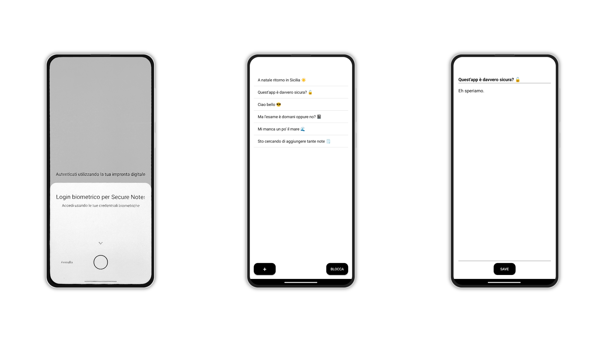
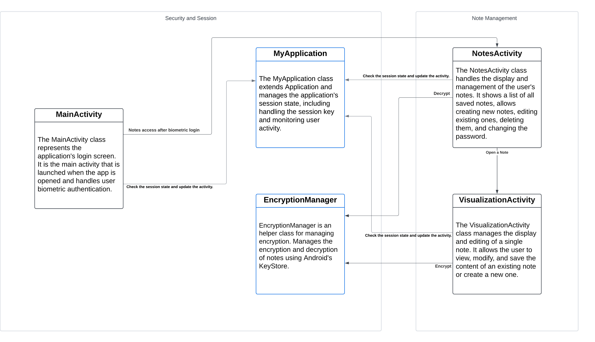

# Overview
The NoteApp is a secure notepad application designed to protect user notes with robust security features. The app requires biometric authentication to access notes and provides functionality for creating, viewing, editing, and deleting notes.

# Functionalities


**Login Screen (MainActivity)**
* **Authentication**: Users must authenticate using their biometric credentials (e.g., fingerprint) to access the app’s features.
* **Biometric Prompt**: Utilizes Android’s BiometricPrompt API to handle secure and user-friendly biometric authentication.

**Notes Screen (NotesActivity)**
* **Viewing Notes**: Displays a list of all saved notes. Each note is represented by its title.
* **Creating a New Note**: Users can add a new note using the + button, which opens a screen to input the title and content.
* **Editing a Note**: Tapping an existing note allows users to view and edit its content.
* **Deleting a Note**: Long-pressing a note brings up a confirmation to delete it.
* **Manual Lock**: Users can manually lock the app using the Lock button, requiring re-authentication to access notes again.

**Visualization Screen (VisualizationActivity)**
* **Note Management**: Allows users to create a new note or edit an existing one by entering the title and content.
* **Secure Saving**: Notes are encrypted before being saved to ensure confidentiality and integrity.

# Security Functionalities

## Biometric Authentication
* Secure Access: Utilizes Android’s BiometricPrompt to ensure that only authorized users can access the app.
```
promptInfo = BiometricPrompt.PromptInfo.Builder()
    .setTitle("Login biometrico per Secure Notes")
    .setSubtitle("Accedi usando le tue credenziali biometriche")
    .setNegativeButtonText("Annulla")
    .build()
	•	Authentication Callbacks: Handles success, error, and failure scenarios to provide appropriate user feedback and access control.

biometricPrompt = BiometricPrompt(this, executor, object : BiometricPrompt.AuthenticationCallback() {

    override fun onAuthenticationError(errorCode: Int, errString: CharSequence) {
        super.onAuthenticationError(errorCode, errString)
        Toast.makeText(applicationContext, "Errore di autenticazione: $errString", Toast.LENGTH_SHORT).show()
    }

    override fun onAuthenticationSucceeded(result: BiometricPrompt.AuthenticationResult) {
        super.onAuthenticationSucceeded(result)
        val app = applicationContext as MyApplication
        app.updateLastActiveTime()
        val intent = Intent(this@MainActivity, NotesActivity::class.java)
        startActivity(intent)
        finish()
    }

    override fun onAuthenticationFailed() {
        super.onAuthenticationFailed()
        Toast.makeText(applicationContext, "Autenticazione fallita", Toast.LENGTH_SHORT).show()
    }
})

```

## Note Encryption
* Encryption Key Management: Utilizes Android’s KeyStore to generate and store a secure AES-256 key used for encrypting and decrypting notes.
```
private fun createSecretKey(): SecretKey? {
    val keyGenerator = KeyGenerator.getInstance(KeyProperties.KEY_ALGORITHM_AES, ANDROID_KEYSTORE)
    val keyGenParameterSpec = KeyGenParameterSpec.Builder(
        KEY_ALIAS,
        KeyProperties.PURPOSE_ENCRYPT or KeyProperties.PURPOSE_DECRYPT
    )
        .setBlockModes(KeyProperties.BLOCK_MODE_GCM)
        .setEncryptionPaddings(KeyProperties.ENCRYPTION_PADDING_NONE)
        .build()
    keyGenerator.init(keyGenParameterSpec)
    return keyGenerator.generateKey()
}
```

* Secure Note Storage: Notes are encrypted with AES-256 in GCM mode, providing both confidentiality and integrity.
```
fun encryptNoteContent(content: String): String {
    val cipher = Cipher.getInstance("AES/GCM/NoPadding")
    val iv = ByteArray(12).apply { SecureRandom().nextBytes(this) }
    val spec = GCMParameterSpec(128, iv)
    cipher.init(Cipher.ENCRYPT_MODE, SecretKeySpec(app.sessionKey, "AES"), spec)
    val encrypted = cipher.doFinal(content.toByteArray(Charsets.UTF_8))
    return Base64.encodeToString(iv + encrypted, Base64.DEFAULT)
}

fun decryptNoteContent(encryptedContent: String): String {
    val decoded = Base64.decode(encryptedContent, Base64.DEFAULT)
    val iv = decoded.copyOfRange(0, 12)
    val encrypted = decoded.copyOfRange(12, decoded.size)
    val cipher = Cipher.getInstance("AES/GCM/NoPadding")
    val spec = GCMParameterSpec(128, iv)
    cipher.init(Cipher.DECRYPT_MODE, SecretKeySpec(app.sessionKey, "AES"), spec)
    val decrypted = cipher.doFinal(encrypted)
    return String(decrypted, Charsets.UTF_8)
}

```

## Access Control
* Session Management: Implements a session timeout mechanism that requires users to re-authenticate after a period of inactivity (e.g., 5 minutes).
```
class MyApplication : Application() {
    var lastActiveTime: Long = System.currentTimeMillis()

    companion object {
        private const val SESSION_TIMEOUT_DURATION = 5 * 60 * 1000 // 5 minuti
    }

    fun isSessionExpired(): Boolean {
        return (System.currentTimeMillis() - lastActiveTime) > SESSION_TIMEOUT_DURATION
    }

    fun updateLastActiveTime() {
        lastActiveTime = System.currentTimeMillis()
    }

    fun clearSession() {
        lastActiveTime = 0L
    }
}
```
Manual Locking: Users can manually lock the app at any time, requiring re-authentication to regain access.

## Secure Coding Practices
* Use of Reliable Libraries: Utilizes Android’s BiometricPrompt and KeyStore for robust authentication and encryption.
* Input Protection: Ensures that all sensitive inputs (e.g., note contents) are handled securely and encrypted before storage.
* No Sensitive Data in Logs: Avoids logging sensitive information such as encryption keys or decrypted note contents.
* Error Handling: Provides user-friendly error messages without exposing sensitive details or internal states.

# Class Diagram

The  Class Diagram is the following:

