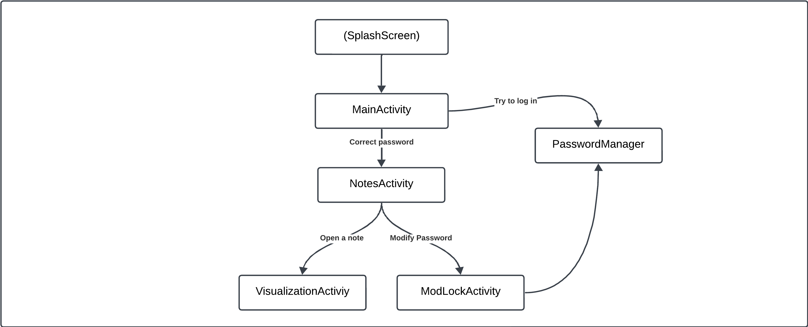

# FIRST ASSIGNMENT
Write a program - secure notepad - the access to which will be secured by a password. After providing the password, the user should be able to display the stored note, change it, change the password. Providing an incorrect password should of course result in lack of access to the note and any possibility of changing the password.
## CLASS DIAGRAM

## HOW TO USE THE APP

### Login with Password Screen (*MainActivity*)
- **Default Password**: When the user starts the app for the first time, the default password is `0000`.
### Notes Screen (*NotesActivity*)
- **Viewing and Editing a Note**: After logging in, the user can see a list of all saved notes. Each list item represents the title of a note.  By clicking on an existing note, the user can open and edit the content of the note.
- **Change Password**: From the notes screen, the user can change the password by clicking on the **M** button. This button opens a screen (***ModLockActiviy***)that allows the user to update their password.
- **Creating a New Note**: The user can add a new note using THE **+** button, which opens a blank screen where the user can input the title and content of the note.
- **Deleting a Note**: The user can delete an existing note by long-pressing it in the list. A confirmation popup will appear to confirm the deletion.
___
# SECOND ASSIGNMENT
Download [the zip archive](https://renmich.faculty.wmi.amu.edu.pl/BSMe/BSM.zip) with source codes of the programs that students produced for the previous exercise. Think how to bypass security in those programs - imagine that your policeman friend asked you to be a police expert, and recovering the message in the phones in police possession will strike a blow against terrorism and make bringing democracy to the world ever closer. What will you advise? Unfortunately, you do not have access to the phone itself, but you can see the application's source code - you have to pass on to police experts the general idea of ​​what to (they will not accept any executable code either, due to their security policies ). Create a plain text file in which you will describe as many ways of breaching security, and general application vulnerabilities as you come up with.

# REPORT
I divided the discussion of security bug hunting in the relevant code into the following sections:

* **Best Practices:** This section describes how the note application should be implemented to minimize the risk of unauthorized access to its content.
* **Correction of My Project:** After studying the concepts covered in class regarding mobile system security, I analyzed my code and found several security issues. In addition to analyzing them, I corrected them by creating a new version of the application, which can be found on GitHub and is described in detail in the respective chapter.
* **Analysis of Some Peers' Projects:** I then proceeded to analyze some of my peers' projects. Many errors were similar to those I made, while others were of a slightly different nature.

With the structure of the report established, we can now begin the discussion.
___
# Best Practices
## Password Security
#### Secure Password Storage
The best way to store passwords is to use Hashing + Unique, Random Salt. 
Specifically:
* **Robust hashing algorithms** such as **bcrypt**, **scrypt**, or **Argon2** are designed to be slow and resistant to brute-force and GPU-based attacks, providing strong security.
* **Unique, random salt for each password**: this salt should be sufficiently long (e.g., 16 bytes) and generated using a cryptographically secure random number generator.
```
Remember that hashing + salt for a password involves:
	hash = HashFunction(password + salt)
and then storing only the hash and associated salt, not the plaintext password.
```
#### Key Stretching
Key stretching involves **increasing the computational complexity** required to calculate the password hash.
```
Example with bcrypt:
	hash = bcrypt(password + salt, cost_factor)
```
This increases the time needed for each attack attempt, making brute-force attacks impractical.
#### Strong Password Policies
Other potential measures to increase password security include:
* **Complexity Requirements**: requiring the password to meet specific criteria:
    * Minimum length of at least $x$ characters.
    * Presence of uppercase and lowercase letters, numbers, and special characters.
    * ...
#### Password Change
When changing a password, it’s necessary to require the current password before allowing the change. Additionally, follow the same hashing and salting process for the new password.
## Note Security
#### Note Encryption
It’s essential to encrypt notes using an encryption key derived from the user-chosen password, ensuring that only users with the correct password can decrypt the notes.
To achieve this, use a secure **Key Derivation Function (KDF)** such as **PBKDF2**, **bcrypt**, or **Argon2** with a separate salt.
```
Example:
	encryption_key = KDF(password, salt_encryption)
```
Algorithms like **AES-256** in **GCM mode** (*Galois/Counter Mode*) can ensure both confidentiality and data integrity (*allows detection of data modifications*).

**Initialization Vectors** (IVs) can also be used: the IV is a unique value utilized with the encryption algorithm to ensure that each time a note is encrypted (even with the same key and content), the ciphertext differs. This value should be stored alongside the encrypted data, as it will be needed for decryption. Typically, the IV is prepended or appended to the ciphertext.
```
Pseudocode example:
	IV = generate_random_iv()
	ciphertext = AES_GCM_encrypt(encryption_key, IV, note_content)
	data_to_store = IV + ciphertext
```
#### Data at Rest Protection
Encrypted notes should be **securely stored** in files or databases with appropriate permissions to prevent unauthorized access at the file system level.
Encryption modes that provide authentication, such as **AES-GCM**, should be used to detect unauthorized data alterations.
## Access Control
#### Mandatory Authentication
Access to notes or password change functions should not be permitted without proper authentication.
#### Secure Sessions
Implement session management mechanisms that expire after a period of inactivity.
Sessions should be tied to the authenticated user and not easily predictable.
#### Limiting Access Attempts
It’s necessary to protect the system from brute-force attack attempts. Measures to implement this protection could include:
* **Limit the number of failed attempts:** after a certain number of failed attempts (*e.g., 5*), temporarily lock the account or require further verification like CAPTCHA.
* **Exponential Delay:** increase the waiting time between attempts to discourage automated attacks.
## Defense Against Attack Types
Protect the application from external attack attempts. Here’s how to prevent the most common types of attacks.
#### Eavesdropping
Involves "intercepting" data related to passwords or notes. Measures to prevent this include:
• **Input Protection:** ensure entered passwords are not visible on-screen (masked input).
• **Secure Channels:** if the application communicates over a network, use secure protocols like **TLS** to encrypt data in transit.
#### Password Guessing
Involves attempting to guess the application password. Implementing **secure hashing** as described in the hashing section can help prevent this.
#### Phishing
There isn’t much that can be done to prevent phishing in a simple app like the one in analysis, but keeping a consistent user interface can reduce the likelihood of users entering credentials in a fake application.
## Secure Coding Practices
#### Use of Reliable Libraries
Use well-tested and up-to-date libraries for all cryptographic operations, such as **OpenSSL**, **libsodium**, or native cryptographic APIs of the chosen language.
Avoid implementing cryptographic algorithms from scratch as they may be unreliable.
