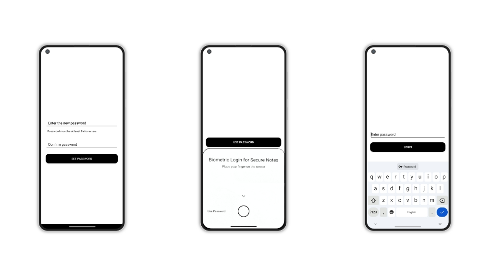
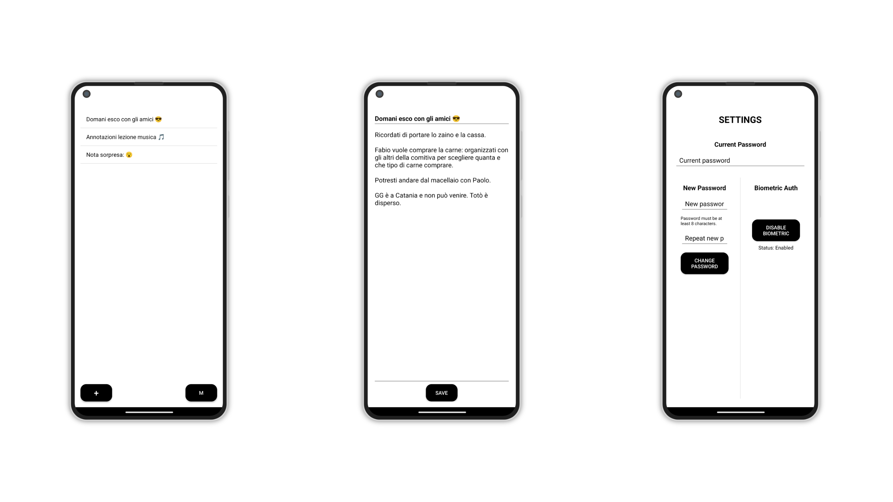

The NoteApp application is designed to protect sensitive data (notes) and the Master Key used to encrypt them through a combination of user passwords, secure key derivation, optional biometrics, and robust encryption. Its goal is to prevent unauthorized access, even if the device is compromised, ensuring the confidentiality and integrity of the notes.

# Authentication Mechanisms

## Password

- **Password Setup on First Use:** Users must create a password without defaults, preventing unauthorized access.
- **Password Hashing with bcrypt:** The password is never stored in plain text. An hash is generated using bcrypt with sufficient cost (BCRYPT_COST) to make brute-force attacks expensive.
- **Complexity Requirements:** Passwords must meet robustness criteria (min. 8 characters, at least one uppercase letter, one lowercase letter, one number, and one special character) to reduce the risk of weak passwords.
- **No Default Passwords:** Eliminates common initial vulnerabilities.

## Biometrics (Optional)

- **Hardware-Backed Keystore:** The app can store an encrypted version of the Master Key using Android’s Keystore backed by the Trusted Execution Environment (TEE). Access to the key requires biometric authentication (fingerprint, face recognition, or other supported methods).
- **UserAuthenticationRequired:** The biometric key is generated with parameters requiring user authentication for every use, preventing unauthorized use even with root privileges.

# Note Encryption

## Master Key and Derivation

- **Generated and Encrypted Master Key:** During password setup, the app generates a 32-byte Master Key. It is never stored in plain text but encrypted using a key derived from the user's password.
- **PBKDF2 Key Derivation:** The app uses PBKDF2 (with SHA-256, 100,000 iterations, and a securely stored unique salt) to derive a symmetric Password-Derived Key.
- **AES-GCM Encryption of Master Key:** The Master Key is encrypted with AES-GCM using the Password-Derived Key. To change the password, the Master Key can be re-encrypted with a new Password-Derived Key.

## Note Encryption

- **AES-256 GCM Mode:** Notes are encrypted with AES/GCM 256-bit using the Master Key. AES ensures robust encryption, while GCM provides message authentication.
- **Unique IVs:** Each encryption operation generates a random Initialization Vector (IV) to prevent key reuse.
- **Encrypted Storage:** Encrypted notes (IV + ciphertext) are stored on disk. Without the correct Master Key, decryption is impossible.

# Access Management and Additional Security

## Attempt Limit and Temporary Lockout

- **Account Lockout:** After multiple failed password attempts (e.g., 5 tries), the account locks temporarily (e.g., 1 minute) to deter brute-force attacks.

## Session Expiration

- **Session Timeout:** Re-authentication is required after inactivity (e.g., 5 minutes) to prevent unauthorized access if the device is unattended.
- **Session Key Clearing:** On session expiration or logout, the Master Key is removed from memory.

## Code Security

- **Reliable Libraries:** Uses established libraries (BCrypt, PBKDF2, AES/GCM) from Android and trusted sources.
- **No Sensitive Data Logs:** Passwords, keys, or plaintext notes are never logged.
- **Safe Error Handling:** Error messages reveal minimal user-friendly information without exposing sensitive details.

# Authentication Flows: Password and Biometrics

## Core Concepts

- **Master Key:** A securely generated AES key never stored in plain text; it encrypts all notes.
- **Password Authentication:** The user provides a password to derive a key for decrypting the Master Key.
- **Biometric Authentication (Optional):** Allows accessing the Master Key without entering a password by using a hardware-backed key in the Android Keystore.

## Password-Based Security Flow

1. **Input:** User enters password.
2. **Verification:**
   - The app checks the bcrypt hash of the entered password.
   - On success, it proceeds; otherwise, failed attempts are incremented.
3. **Key Derivation (PBKDF2):**
   - Uses the password and a stored salt to derive a robust symmetric key.
4. **Decrypt Master Key:**
   - Decrypts the Master Key stored in encrypted form using AES/GCM and the Password-Derived Key.
5. **Note Access:**
   - With the decrypted Master Key, notes can be accessed.
   - The Master Key remains in memory during the session and is cleared when the session ends.

## Biometric-Based Security Flow

1. **Setup (One-Time):**
   - User enters a password and decrypts the Master Key.
   - The Master Key is encrypted using a hardware-backed key requiring biometrics.
2. **Access with Biometrics:**
   - The user authenticates biometrically.
   - Android provides a Cipher to decrypt the Master Key encrypted with the biometric key.
3. **Decrypt Master Key:**
   - The Master Key is decrypted and loaded into RAM.
4. **Note Access:**
   - Notes are decrypted using the Master Key.

# Summary

| Method      | Input         | Key Derivation       | Master Key Decryption |
|-------------|---------------|----------------------|------------------------|
| Password    | Password      | PBKDF2 + bcrypt      | AES/GCM with Password-Derived Key |
| Biometrics  | Biometric Data| Keystore Cipher      | AES/GCM with Hardware-Backed Key |

## Keystore and Biometric Security

- **Hardware Protection:** Biometric keys are inaccessible to user-space applications and remain within the TEE.
- **Root Access Defense:** Even with root privileges, attackers cannot extract the hardware-backed key or bypass biometric prompts.
