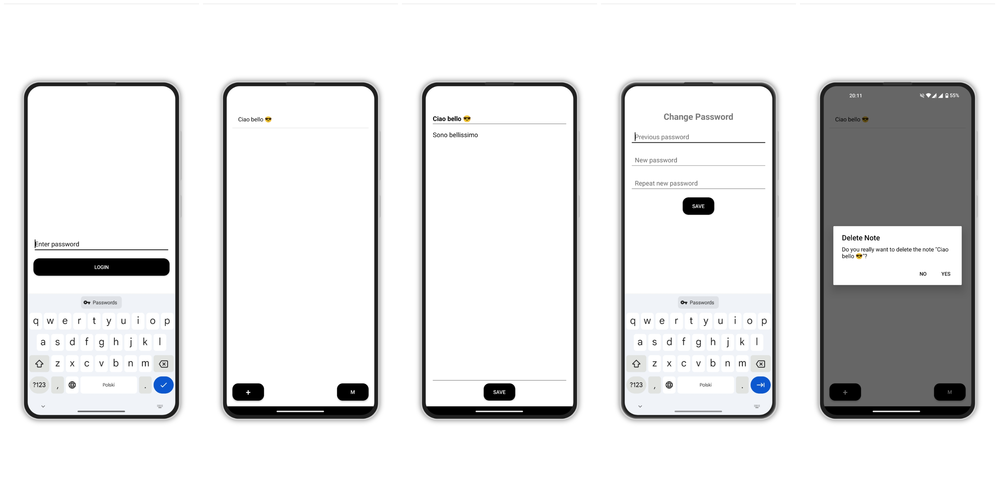

# FIRST ASSIGNMENT
Write a program - secure notepad - the access to which will be secured by a password. After providing the password, the user should be able to display the stored note, change it, change the password. Providing an incorrect password should of course result in lack of access to the note and any possibility of changing the password.
## CLASS DIAGRAM

## HOW TO USE THE APP

### Login with Password Screen (*MainActivity*)
- **Default Password**: When the user starts the app for the first time, the default password is `0000`.
### Notes Screen (*NotesActivity*)
- **Viewing and Editing a Note**: After logging in, the user can see a list of all saved notes. Each list item represents the title of a note.  By clicking on an existing note, the user can open and edit the content of the note.
- **Change Password**: From the notes screen, the user can change the password by clicking on the **M** button. This button opens a screen (***ModLockActiviy***)that allows the user to update their password.
- **Creating a New Note**: The user can add a new note using THE **+** button, which opens a blank screen where the user can input the title and content of the note.
- **Deleting a Note**: The user can delete an existing note by long-pressing it in the list. A confirmation popup will appear to confirm the deletion.
___
# SECOND ASSIGNMENT
Download [the zip archive](https://renmich.faculty.wmi.amu.edu.pl/BSMe/BSM.zip) with source codes of the programs that students produced for the previous exercise. Think how to bypass security in those programs - imagine that your policeman friend asked you to be a police expert, and recovering the message in the phones in police possession will strike a blow against terrorism and make bringing democracy to the world ever closer. What will you advise? Unfortunately, you do not have access to the phone itself, but you can see the application's source code - you have to pass on to police experts the general idea of ​​what to (they will not accept any executable code either, due to their security policies ). Create a plain text file in which you will describe as many ways of breaching security, and general application vulnerabilities as you come up with.

# REPORT
I divided the discussion of security bug hunting in the relevant code into the following sections:

* **Best Practices:** This section describes how the note application should be implemented to minimize the risk of unauthorized access to its content.
* **Correction of My Project:** After studying the concepts covered in class regarding mobile system security, I analyzed my code and found several security issues. In addition to analyzing them, I corrected them by creating a new version of the application, which can be found on GitHub and is described in detail in the respective chapter.
* **Analysis of Some Peers' Projects:** I then proceeded to analyze some of my peers' projects. Many errors were similar to those I made, while others were of a slightly different nature.

With the structure of the report established, we can now begin the discussion.
___
# Best Practices
## Password Security
#### Secure Password Storage
The best way to store passwords is to use Hashing + Unique, Random Salt. 
Specifically:
* **Robust hashing algorithms** such as **bcrypt**, **scrypt**, or **Argon2** are designed to be slow and resistant to brute-force and GPU-based attacks, providing strong security.
* **Unique, random salt for each password**: this salt should be sufficiently long (e.g., 16 bytes) and generated using a cryptographically secure random number generator.
```
Remember that hashing + salt for a password involves:
	hash = HashFunction(password + salt)
and then storing only the hash and associated salt, not the plaintext password.
```
#### Key Stretching
Key stretching involves **increasing the computational complexity** required to calculate the password hash.
```
Example with bcrypt:
	hash = bcrypt(password + salt, cost_factor)
```
This increases the time needed for each attack attempt, making brute-force attacks impractical.
#### Strong Password Policies
Other potential measures to increase password security include:
* **Complexity Requirements**: requiring the password to meet specific criteria:
    * Minimum length of at least $x$ characters.
    * Presence of uppercase and lowercase letters, numbers, and special characters.
    * ...
#### Password Change
When changing a password, it’s necessary to require the current password before allowing the change. Additionally, follow the same hashing and salting process for the new password.
## Note Security
#### Note Encryption
It’s essential to encrypt notes using an encryption key derived from the user-chosen password, ensuring that only users with the correct password can decrypt the notes.
To achieve this, use a secure **Key Derivation Function (KDF)** such as **PBKDF2**, **bcrypt**, or **Argon2** with a separate salt.
```
Example:
	encryption_key = KDF(password, salt_encryption)
```
Algorithms like **AES-256** in **GCM mode** (*Galois/Counter Mode*) can ensure both confidentiality and data integrity (*allows detection of data modifications*).

**Initialization Vectors** (IVs) can also be used: the IV is a unique value utilized with the encryption algorithm to ensure that each time a note is encrypted (even with the same key and content), the ciphertext differs. This value should be stored alongside the encrypted data, as it will be needed for decryption. Typically, the IV is prepended or appended to the ciphertext.
```
Pseudocode example:
	IV = generate_random_iv()
	ciphertext = AES_GCM_encrypt(encryption_key, IV, note_content)
	data_to_store = IV + ciphertext
```
#### Data at Rest Protection
Encrypted notes should be **securely stored** in files or databases with appropriate permissions to prevent unauthorized access at the file system level.
Encryption modes that provide authentication, such as **AES-GCM**, should be used to detect unauthorized data alterations.
## Access Control
#### Mandatory Authentication
Access to notes or password change functions should not be permitted without proper authentication.
#### Secure Sessions
Implement session management mechanisms that expire after a period of inactivity.
Sessions should be tied to the authenticated user and not easily predictable.
#### Limiting Access Attempts
It’s necessary to protect the system from brute-force attack attempts. Measures to implement this protection could include:

* **Limit the number of failed attempts:** after a certain number of failed attempts (*e.g., 5*), temporarily lock the account or require further verification like CAPTCHA.
* **Exponential Delay:** increase the waiting time between attempts to discourage automated attacks.

## Defense Against Attack Types
Protect the application from external attack attempts. Here’s how to prevent the most common types of attacks.
#### Eavesdropping
Involves "intercepting" data related to passwords or notes. Measures to prevent this include:
• **Input Protection:** ensure entered passwords are not visible on-screen (masked input).
• **Secure Channels:** if the application communicates over a network, use secure protocols like **TLS** to encrypt data in transit.
#### Password Guessing
Involves attempting to guess the application password. Implementing **secure hashing** as described in the hashing section can help prevent this.
#### Phishing
There isn’t much that can be done to prevent phishing in a simple app like the one in analysis, but keeping a consistent user interface can reduce the likelihood of users entering credentials in a fake application.
## Secure Coding Practices
#### Use of Reliable Libraries
Use well-tested and up-to-date libraries for all cryptographic operations, such as **OpenSSL**, **libsodium**, or native cryptographic APIs of the chosen language.
Avoid implementing cryptographic algorithms from scratch as they may be unreliable.
___
# Correction of My Project
I will now proceed with the analysis of the errors in my project and the explanation of the strategies I used to correct these errors.
## Password Security
#### Password Storage
The `PasswordManager` class stores the user’s password in plaintext using `EncryptedSharedPreferences`.
```
fun setPassword(newPassword: String) {
    sharedPreferences.edit().putString(PASSWORD_KEY, newPassword).apply()
}

fun getPassword(): String {
    return sharedPreferences.getString(PASSWORD_KEY, DEFAULT_PASSWORD) ?: DEFAULT_PASSWORD
}

fun isPasswordCorrect(enteredPassword: String): Boolean {
    return enteredPassword == getPassword()
}
```
Additionally, password verification is done by directly comparing the entered password with the stored one, making it vulnerable to timing attacks:
```
fun isPasswordCorrect(enteredPassword: String): Boolean {
    return enteredPassword == getPassword()
}
```
**Solution:** I modified the `setPassword` method to store the password hash instead of the plaintext password. Specifically, bcrypt is used to hash and salt the password securely:
```
import org.mindrot.jbcrypt.BCrypt

fun setPassword(newPassword: String) {
    val passwordHash = BCrypt.hashpw(newPassword, BCrypt.gensalt())
    sharedPreferences.edit().putString(PASSWORD_HASH_KEY, passwordHash).apply()
}

fun isPasswordCorrect(enteredPassword: String): Boolean {
    val storedHash = sharedPreferences.getString(PASSWORD_HASH_KEY, null)
    return if (storedHash != null) {
        BCrypt.checkpw(enteredPassword, storedHash)
    } else {
        false
    }
}
```
This method also performs the comparison in a secure and constant manner, resistant to timing attacks.
#### Password Initialization
On the system’s first startup, it requests a default password ($0000$) to access the application.
```
companion object {
    private const val PASSWORD_KEY = "user_password"
    private const val DEFAULT_PASSWORD = "0000"
}

fun getPassword(): String {
    return sharedPreferences.getString(PASSWORD_KEY, DEFAULT_PASSWORD) ?: DEFAULT_PASSWORD
}

fun isPasswordCorrect(enteredPassword: String): Boolean {
    return enteredPassword == getPassword()
}
```
An attacker could exploit this vulnerability by deleting the saved password, allowing the application to fall back to the default password, thereby gaining access to the notes.

**Solution:** I resolved this by eliminating the concept of a "default password" and requiring the user to create a new password on first startup:
```
companion object {
    private const val PASSWORD_HASH_KEY = "user_password_hash"
}

fun isPasswordSet(): Boolean {
    return sharedPreferences.contains(PASSWORD_HASH_KEY)
}

fun isPasswordCorrect(enteredPassword: String): Boolean {
    val storedHash = sharedPreferences.getString(PASSWORD_HASH_KEY, null)
    return if (storedHash != null) {
        BCrypt.checkpw(enteredPassword, storedHash)
    } else {
        false
    }
}
```
If `isPasswordSet` returns false, the user is redirected to `SetPasswordActivity` to create a new password, eliminating dependence on the default password:
```
if (!passwordManager.isPasswordSet()) {
    val intent = Intent(this, SetPasswordActivity::class.java)
    startActivity(intent)
    finish()
    return
}

loginButton.setOnClickListener {
    val enteredPassword = passwordEditText.text.toString()

    if (passwordManager.isPasswordCorrect(enteredPassword)) {
        val intent = Intent(this, NotesActivity::class.java)
        intent.putExtra("userPassword", enteredPassword)
        startActivity(intent)
        finish()
    } else {
        Toast.makeText(this, "Incorrect password", Toast.LENGTH_SHORT).show()
    }
}
```
Note: As we will see later, notes are encrypted using an encryption key derived directly from the user’s chosen password. If an attacker deletes the current password by accessing the initial password setup screen, the old notes remain encrypted with the old encryption key and are therefore inaccessible. The only way to change the password without making the notes inaccessible is to use the password change function, as discussed in the following sections.
#### Absence of Key Stretching
No key stretching is applied to passwords, which increases computational difficulty for brute-force attacks.

**Solution:** As in the previous point, bcrypt was used for hashing passwords, which includes built-in key stretching. It’s important to ensure the cost factor is appropriately configured to balance security and performance. In the new code, I set the cost factor to 10 (~100 ms per hash):
```
private const val BCRYPT_COST = 10  // Fattore di costo configurabile
```
and applied it during hashing:
```
val passwordHash = BCrypt.hashpw(newPassword, BCrypt.gensalt(BCRYPT_COST))
```
#### Lack of Password Complexity Requirements
The application does not enforce any complexity requirements for passwords when the user changes their password through `ModLockActivity`. Now that we have implemented a `SetPasswordActivity`, it’s also necessary to ensure the initial password meets security criteria.

**Solution:** I implemented a function, `checkPasswordComplexity`, that verifies if the password meets complexity requirements, including:
* **Minimum length**: at least 8 characters
* **Required character types**:
    * At least one uppercase letter
    * At least one lowercase letter
    * At least one number
    * At least one special character
This function returns a boolean (indicating password validity) and a message to provide feedback on unmet requirements.
#### New password interface
To manage these new features, a new password setup activity has been added for the first launch:

The password change interface has also been modified to align with the rest of the features:


## Note Security
#### Note Encryption Not Based on User’s Password
In the old code, notes are stored using `EncryptedSharedPreferences` with a key derived from `MasterKeys`, not from the user’s password. This means that notes can be decrypted without the user’s password if the device is compromised.
```
// Save note
private fun saveNote(newTitle: String, content: String) {
    val noteTitles = sharedPreferences.getStringSet(noteTitlesKey, mutableSetOf())!!.toMutableSet()
    noteTitles.add(newTitle)
    sharedPreferences.edit().putStringSet(noteTitlesKey, noteTitles).apply()
    sharedPreferences.edit().putString(newTitle, content).apply()
}

// Get the note
val noteContent = sharedPreferences.getString(originalTitle, "")
bodyEditText.setText(noteContent)
```
**Solution:** To tie note encryption to the user’s password, a **session key** was derived using the password via **PBKDF2**. This key is used to encrypt and decrypt notes, ensuring they’re accessible only when the correct password is entered.

I considered two options:
1. Prompt the user for the password each time a note is accessed, avoiding storing the encryption key in memory.
2. Prompt the user only at login or password change, deriving a session key via PBKDF2, temporarily stored in `MyApplication` for encryption and decryption operations.
I chose the second option as the best trade-off between app usability and security.
```
private fun deriveSessionKey(password: String) {
    val pbkdf2SaltString = sharedPreferences.getString(PBKDF2_SALT_KEY, null) ?: return
    val pbkdf2Salt = Base64.decode(pbkdf2SaltString, Base64.DEFAULT)
    val spec = PBEKeySpec(password.toCharArray(), pbkdf2Salt, PBKDF2_ITERATIONS, KEY_LENGTH)
    val factory = SecretKeyFactory.getInstance("PBKDF2WithHmacSHA256")
    val key = factory.generateSecret(spec).encoded

    val app = context.applicationContext as MyApplication
    app.sessionKey = key
}
```
Note: If the password is changed, all notes are decrypted with the old key and re-encrypted with the new key derived from the new password (*no good for performances, ok for security*).
#### Notes interface
The notes interface has not changed from the previous version.


## Access Control
#### Lack of Access Attempt Limitation
In the old code, no limit is imposed on failed login attempts, allowing an attacker to try infinite password combinations without penalty.

**Solution:** I introduced a temporary lockout system after a certain number of failed attempts:
* **Failed Access Attempts Counter**: A counter is incremented on each failed attempt, saved in `SharedPreferences` under `ATTEMPT_COUNT_KEY`.
* **Temporary Lockout**: After a maximum number of failed attempts (defined as `MAX_ATTEMPTS`, set to 5), access is temporarily blocked. The time of the last failed attempt is recorded, and the lockout remains until `LOCKOUT_DURATION` (1 minute) has passed.
* **Lockout Status Check**: The `isLockedOut()` function checks if the user is locked out, considering both failed attempts and time since the last attempt. This function is made public for access from `MainActivity`.
* **Attempt Reset After Successful Access**: On the first successful login, failed attempts are reset with the `resetFailedAttempts()` function.
#### Lack of Secure Session Management
The app does not implement session management mechanisms. Once logged in, there are no timeouts or session expirations. If the user leaves the app open, another person could access notes without re-authentication.

**Solution:** I implemented a session timeout that requires re-authentication after inactivity, managed in `MyApplication` along with temporary key storage:
```
class MyApplication : Application() {

    var sessionKey: ByteArray? = null
    var lastActiveTime: Long = System.currentTimeMillis()

    companion object {
        private const val SESSION_TIMEOUT_DURATION = 5 * 60 * 1000 // 5 minutes
    }

    fun isSessionExpired(): Boolean {
        return (System.currentTimeMillis() - lastActiveTime) > SESSION_TIMEOUT_DURATION
    }

    fun updateLastActiveTime() {
        lastActiveTime = System.currentTimeMillis()
    }

    fun clearSession() {
        sessionKey = null
        lastActiveTime = 0L
    }
}
```
#### New Class Scheme
The new class diagram is as follows:


___
## Exploiting Vulnerabilities of the Old Implementation
As we have seen, the old code contains several vulnerabilities. Below are some ways to exploit these vulnerabilities to gain unauthorized access to notes.
#### Physical Access Attacks and Device Compromise
This type of attack is possible because:
* **Password stored in plaintext**: The user’s password is stored in plaintext and is accessible via the Android Keystore. If an attacker gains physical access to the device or exploits a vulnerability in the Keystore, they can extract the encryption key and read the password.
* **Note encryption key stored on the device**: Notes are encrypted with a locally stored key, which is vulnerable if the Keystore is compromised or if the attacker has root access to the device.
#### Configuration Manipulation and Password Reset Attacks
In the old code, the "default password" approach is used, as seen in previous sections. If the saved password is removed, the application falls back on a default password (“0000”), allowing an attacker to access data by clearing the password value in SharedPreferences.
#### Brute-Force Attacks
An attacker could attempt to obtain the password using brute-force methods because:
* **No limit on login attempts**: The application allows unlimited login attempts without penalty or delay, enabling an attacker to use automated tools to try all password combinations.
* **Lack of password complexity requirements**: If the password is weak, a brute-force attack can be especially effective.
#### Timing-Based Attacks
Password verification is performed with a simple equality comparison, which can take varying amounts of time depending on the number of correct characters, exposing the app to timing attacks that deduce the password character by character.
#### Session Management Absence Attacks
Once logged in, the app remains accessible without requiring re-authentication. Anyone with physical access to the device can access notes if the app is open or running in the background.
